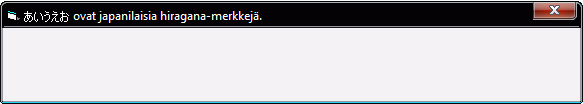

<div align="center">

## UniCaption \- unicode caption for your forms


</div>

### Description

By a request here, I was fooling around with different ways of changing a form's caption to Unicode. I've seen commercial controls that take over the drawing routine with some heavy subclassing and other similar poor attempts, which have then broken, if not when theme changes, then by when Vista got released.

I started off by figuring out a way to create a custom Unicode window and then make an existing form a child of it, but this got pretty messy and I wasn't very happy with the complexity. However, I had a bug during this process that I by mistake used a non-Unicode version of DefWindowProc, which prevented the caption to be Unicode. And it didn't take me long to figure out that by temporarily changing a window's window procedure any window caption can be made Unicode.

So here it is: a very short and clean way to have an Unicode caption in your forms! The code can be pasted directly to your form.
 
### More Info
 


<span>             |<span>
---                |---
**Submitted On**   |
**By**             |[Vesa Piittinen](https://github.com/Planet-Source-Code/PSCIndex/blob/master/ByAuthor/vesa-piittinen.md)
**Level**          |Beginner
**User Rating**    |5.0 (30 globes from 6 users)
**Compatibility**  |VB 4\.0 \(32\-bit\), VB 5\.0, VB 6\.0
**Category**       |[VB function enhancement](https://github.com/Planet-Source-Code/PSCIndex/blob/master/ByCategory/vb-function-enhancement__1-25.md)
**World**          |[Visual Basic](https://github.com/Planet-Source-Code/PSCIndex/blob/master/ByWorld/visual-basic.md)
**Archive File**   |[](https://github.com/Planet-Source-Code/vesa-piittinen-unicaption-unicode-caption-for-your-forms__1-70718/archive/master.zip)


### Source Code

```
Option Explicit
Private Declare Function GetModuleHandleW Lib "kernel32" (ByVal lpModuleName As Long) As Long
Private Declare Function GetProcAddress Lib "kernel32" (ByVal hModule As Long, ByVal lpProcName As String) As Long
Private Declare Function GetWindowLongA Lib "user32" (ByVal hWnd As Long, ByVal nIndex As Long) As Long
Private Declare Function SetWindowLongA Lib "user32" (ByVal hWnd As Long, ByVal nIndex As Long, ByVal dwNewLong As Long) As Long
Private Declare Function SetWindowLongW Lib "user32" (ByVal hWnd As Long, ByVal nIndex As Long, ByVal dwNewLong As Long) As Long
Private Declare Function SetWindowTextW Lib "user32" (ByVal hWnd As Long, ByVal lpString As Long) As Long
Private Const GWL_WNDPROC = -4
Private m_Caption As String
Public Property Get CaptionW() As String
  CaptionW = m_Caption
End Property
Public Property Let CaptionW(ByRef NewValue As String)
  Static WndProc As Long, VBWndProc As Long
  m_Caption = NewValue
  ' get window procedures if we don't have them
  If WndProc = 0 Then
    ' the default Unicode window procedure
    WndProc = GetProcAddress(GetModuleHandleW(StrPtr("user32")), "DefWindowProcW")
    ' window procedure of this form
    VBWndProc = GetWindowLongA(hWnd, GWL_WNDPROC)
  End If
  ' ensure we got them
  If WndProc <> 0 Then
    ' replace form's window procedure with the default Unicode one
    SetWindowLongW hWnd, GWL_WNDPROC, WndProc
    ' change form's caption
    SetWindowTextW hWnd, StrPtr(m_Caption)
    ' restore the original window procedure
    SetWindowLongA hWnd, GWL_WNDPROC, VBWndProc
  Else
    ' no Unicode for us
    Caption = m_Caption
  End If
End Property
' usage sample
Private Sub Form_Load()
  ' some hiragana (you need Japanese fonts installed to see them)
  CaptionW = ChrW$(&H3042) & ChrW$(&H3044) & ChrW$(&H3046) & ChrW$(&H3048) & ChrW$(&H304A) & " ovat japanilaisia hiragana-merkkejä."
End Sub
```

